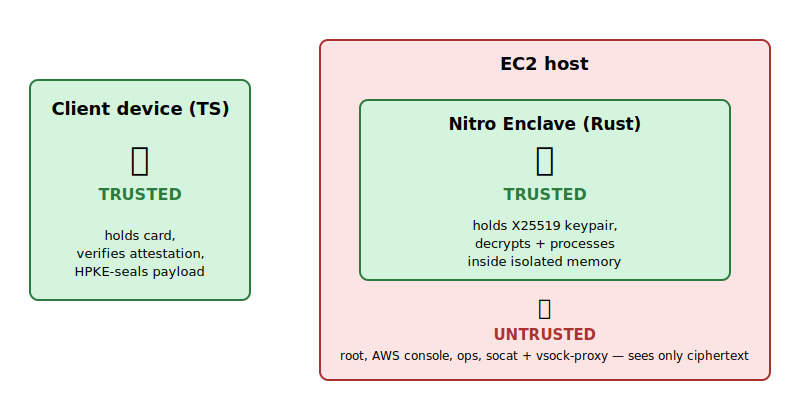
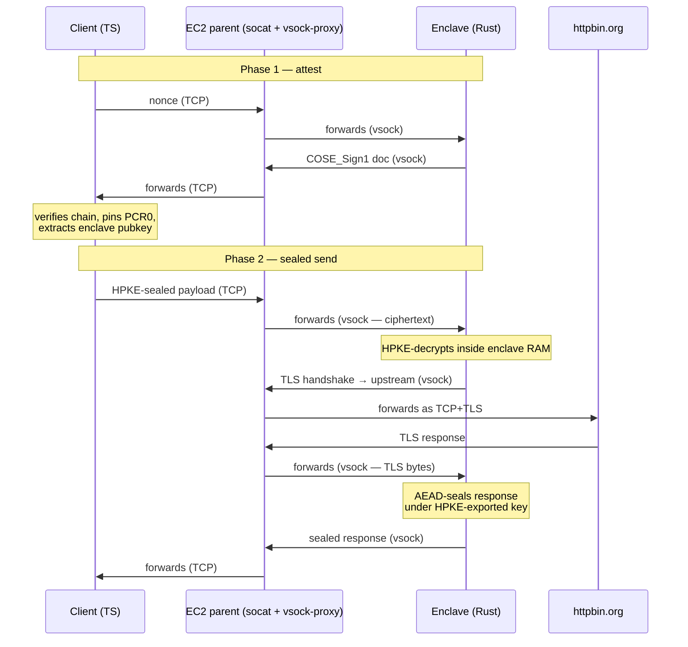

# Nitro Attested Proxy

End-to-end **remote attestation** against AWS Nitro Enclaves: a TypeScript client refuses to encrypt anything until it has cryptographic proof of the exact code running on the enclave's hardware. From that moment on, the EC2 host operator — even with `root` — sees only ciphertext.

> Rust · Bun + TypeScript · AWS Nitro Enclaves · OpenTofu · HPKE · COSE_Sign1 · X25519 · AES-256-GCM · vsock · rustls

<p align="center">
  
</p>

### Using the SDK

```ts
import { AttestedClient } from "./sdk";

const session = await AttestedClient.open({ host });
console.log(`verified ${session.doc.module_id} pcr0=${session.pcr0Hex}`);
//   ↑ COSE chain validated to the AWS Nitro root, PCR0 matches the pin

const response = await session.send("sensitive payload");
//   ↑ HPKE-sealed under a key the client just proved was bound to the
//     attested code. The host sees only ciphertext.
```

### What you actually see

```
$ just client --message=hello
verified i-0f738619095d552a1-enc019df809d1542570
pcr0=5638f600d4eac2eb6839dd450414626d5d68a2cffff864b48ef03d212791b32019c0a40699a9e22740c28ccb238057c8

decrypted:
  args:    {}
  data:    "hello"
  headers: { Host: "httpbin.org", ... }
  url:     "https://httpbin.org/post"
```

The enclave decrypted the payload inside isolated memory, opened a TLS session **from inside the enclave** to `httpbin.org`, POSTed the plaintext, and returned the response encrypted back to the client. At no point did the EC2 host hold plaintext.

### What this does

- A TypeScript client sends a sensitive payload (e.g. a credit card number) to a Rust service running inside a Nitro Enclave.
- Before sending anything, the client demands cryptographic proof of *what code* is running and *on what hardware*.
- The enclave produces a signed attestation document. The client verifies the chain back to the AWS Nitro root, pins the code measurement (PCR0), and extracts a public key bound to that proof.
- The client encrypts the payload to that key. The enclave decrypts inside isolated memory, processes the payload, returns an encrypted response.
- The EC2 host — and anyone with `root` on it — sees only ciphertext throughout.

### Security model

- The host operator, including `root` on the parent EC2 instance, cannot read payloads, responses, or the enclave's private key.
- The host cannot swap the enclave's keypair or substitute different code without breaking the COSE signature chain.
- The client refuses to encrypt to anything that does not verify back to the AWS Nitro root certificate.
- A malicious host running the outbound proxy cannot redirect the upstream TLS session — the enclave validates the cert chain against a compile-time SNI, covered by PCR0.

### How it works



1. Enclave generates an X25519 keypair on startup. The private key never leaves enclave memory.
2. Enclave asks `/dev/nsm` for a `COSE_Sign1` attestation document binding `(PCR0, public_key, hardware identity)`. The NSM signs with a per-instance key chained to the AWS Nitro root.
3. Client walks the certificate chain to the pinned root, checks PCR0, and extracts the public key **from the signed document** — not from a separate field. That distinction is load-bearing.
4. Client HPKE-seals the payload to the attested key.
5. Enclave decrypts, makes a real outbound HTTPS call to `httpbin.org` over TLS-inside-vsock, and returns the response encrypted under the same HPKE session.

Any failure — expired cert, wrong signer, mismatched PCR, debug-mode enclave — and the client refuses to send.

This uses a two-phase flow (attest, then HPKE-seal under the attested key) rather than attested-TLS, where attestation is bound directly into the TLS handshake — simpler to implement and reason about, at the cost of an extra round-trip per session.

### Quickstart

Prerequisites: AWS credentials, [OpenTofu](https://opentofu.org/), [just](https://github.com/casey/just), [Bun](https://bun.sh/).

```sh
just infra-up                     # provision enclave-enabled EC2 (~2 min)
just deploy                       # sync source, build EIF, run enclave + bridges (~3 min)
just pin-pcrs                     # pin the freshly-built PCR0 for the client to verify against
just client                       # attest only (prints verified module_id + PCR0)
just client --message=hello       # attest + send a payload + print the response
just example                      # exercise the SDK with three sequential sends
just infra-down                   # tear down
```

All workflows run through `just` — run with no arguments to list every recipe.
